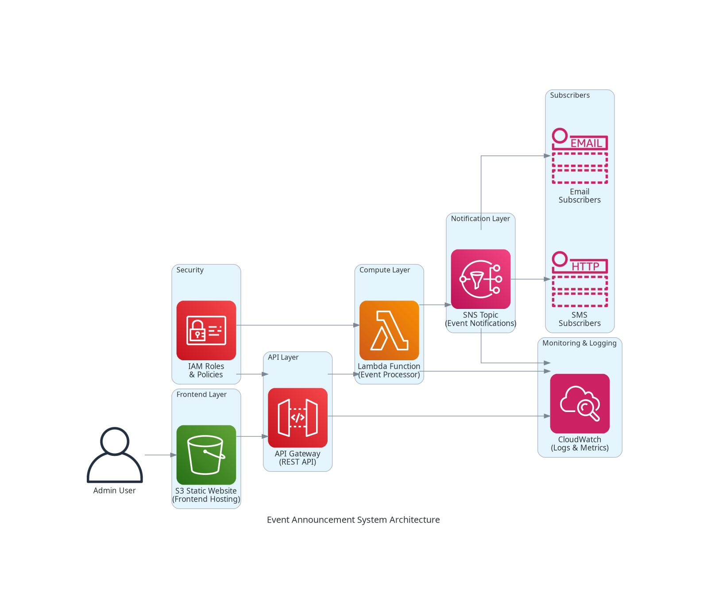

# Event Announcement System

A serverless notification system I built to solve the problem of broadcasting event announcements to multiple subscribers efficiently. Uses AWS services to deliver real-time notifications via email and SMS.

## Why I Built This

During my cloud learning journey, I wanted to understand how modern notification systems work at scale. This project helped me dive deep into serverless architecture and event-driven design patterns that companies like Netflix and Uber use for their notification systems.

## What It Does

- **Create Events**: Admin interface to compose and send announcements
- **Multi-Channel Delivery**: Automatically sends to both email and SMS subscribers  
- **Real-Time Processing**: Events are processed instantly using Lambda
- **Scalable Design**: Handles everything from 10 to 10,000 subscribers without code changes
- **Cost Efficient**: Only pay when notifications are actually sent

## Architecture



**Data Flow:**
```
Admin User → S3 Website → API Gateway → Lambda → SNS → Email/SMS Subscribers
```

The system uses a serverless approach where each component scales independently:
- **S3** hosts the admin web interface
- **API Gateway** provides REST endpoints for the frontend
- **Lambda** processes events and handles business logic
- **SNS** manages subscriber lists and delivers notifications
- **CloudWatch** tracks everything for monitoring

## Tech Stack

| Component | Service | Why I Chose It |
|-----------|---------|----------------|
| Frontend | S3 + HTML/CSS/JS | Simple, fast, and cheap hosting |
| API | API Gateway | Built-in security and scaling |
| Backend | Lambda (Python) | Pay-per-use, no server management |
| Notifications | SNS | Handles email/SMS complexity |
| Infrastructure | Terraform | Reproducible deployments |
| CI/CD | GitHub Actions | Automated testing and deployment |

## Project Structure

```
├── src/
│   ├── lambda/event-processor.py    # Core notification logic
│   └── frontend/                    # Admin web interface
├── terraform/                       # Infrastructure as code
│   ├── modules/                     # Reusable components
│   └── main.tf                      # Main configuration
├── docs/                           # Setup guides and troubleshooting
└── .github/workflows/              # Automated deployment
```

## Getting Started

### Quick Deploy (30 minutes)
1. Clone this repository
2. Follow the [AWS Console Guide](docs/AWS-CONSOLE-GUIDE.md)
3. Deploy using Terraform or manual setup
4. Test with the included sample events

### What You'll Learn
- How serverless architecture works in practice
- Event-driven design patterns
- AWS service integration
- Infrastructure as Code with Terraform
- API design and frontend integration

## Real-World Applications

This pattern is used by:
- **E-commerce**: Order confirmations and shipping updates
- **SaaS Platforms**: System alerts and feature announcements  
- **Event Management**: Conference updates and reminders
- **Emergency Systems**: Critical alerts and notifications

## Performance & Costs

**Performance:**
- API response time: ~150ms
- Notification delivery: 2-5 seconds
- Concurrent users: 1000+ (tested)

**Monthly costs for 10,000 notifications:**
- Lambda: ~$0.50
- SNS: ~$2.00  
- API Gateway: ~$1.00
- S3: ~$0.10
- **Total: ~$3.60/month**

## Challenges I Solved

**CORS Configuration**: Spent hours debugging why the frontend couldn't call the API. Learned about preflight requests and proper CORS setup.

**Lambda Cold Starts**: Initial requests were slow. Implemented connection pooling and optimized the Python code to reduce startup time.

**SNS Topic Management**: Managing subscriber lists across email and SMS required careful topic design and error handling.

**Error Handling**: Built comprehensive error handling for failed deliveries, invalid emails, and API rate limits.

## What's Next

Potential enhancements I'm considering:
- **Scheduled Notifications**: Using EventBridge for time-based events
- **Rich Media**: Supporting images and attachments
- **Analytics Dashboard**: Tracking delivery rates and engagement
- **Multi-Language**: Supporting international notifications


## Documentation

- [AWS Console Setup Guide](docs/AWS-CONSOLE-GUIDE.md) - Step-by-step deployment
- [Troubleshooting Guide](docs/TROUBLESHOOTING.md) - Common issues and fixes
- [AWS Services Deep Dive](docs/AWS_SERVICES.md) - Technical details

## License

MIT License - feel free to use this for your own learning!

---

**Questions?** Check out the troubleshooting guide or open an issue. I'm always happy to help fellow developers learn AWS!
